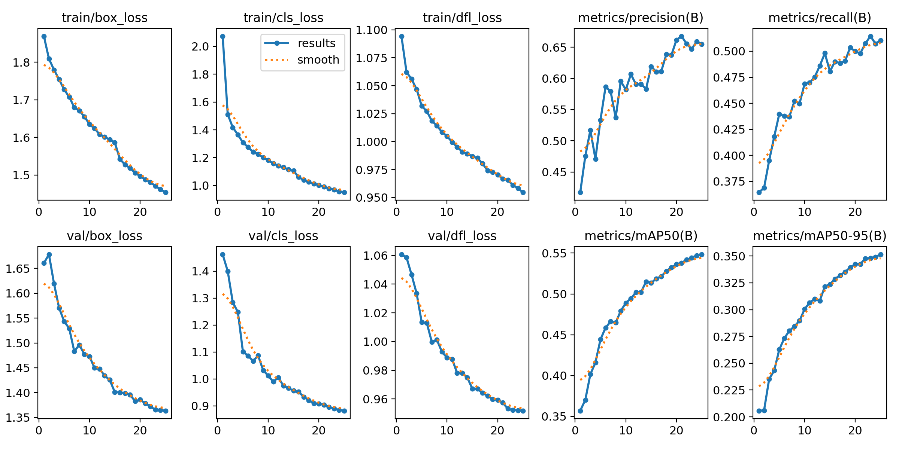
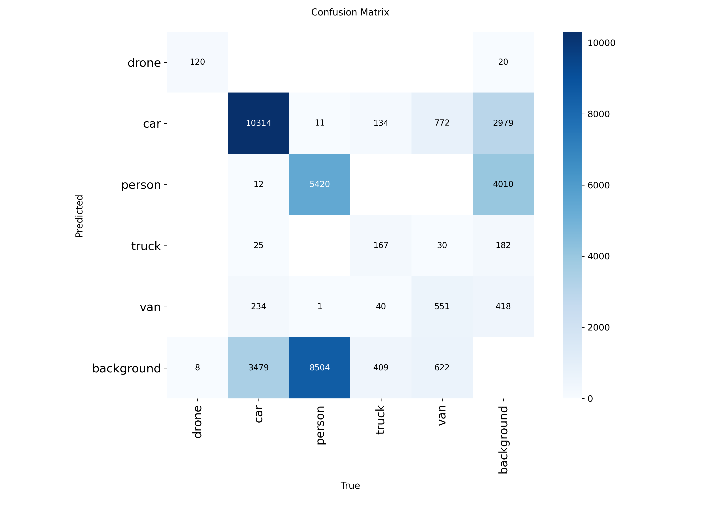

# Multi-Class Aerial Object Detector

A 5-class object detection model trained on merged VisDrone + drone datasets, designed for aerial surveillance from tethered aerostats or UAV platforms. Detects drones, cars, persons, trucks, and vans from aerial perspective.

## What it does

Detects and classifies five object types in aerial/drone-view imagery, drawing labeled bounding boxes with confidence scores. Includes SAHI (Slicing Aided Hyper Inference) integration for improved small-object detection at altitude.

## Datasets

This model was trained on a **merged dataset of 15,831 images** combining two sources:

- **Drone detection dataset** (7,205 images, 1 class: drone) — [Roboflow Universe](https://universe.roboflow.com/keypointdetection-bwrv7/drones-detect-qhrmt), CC BY 4.0
- **VisDrone dataset** (8,626 images, filtered to 4 classes: car, person, truck, van) — [Roboflow Universe](https://universe.roboflow.com/dersi/visdrone-detection-2), aerial imagery from UAV platforms

Dataset merging involved remapping class IDs across both sources into a unified 5-class schema (drone=0, car=1, person=2, truck=3, van=4), filtering out unused VisDrone classes (bus, bicycle, motor, tricycle), and merging "pedestrian" and "people" labels into a single "person" class.

## Training setup

- **Model:** YOLOv8n (nano) — edge-deployable at 6.2 MB
- **Method:** Transfer learning from COCO-pretrained weights
- **Epochs:** 25
- **Image size:** 640×640
- **Batch size:** 16
- **Hardware:** Google Colab, NVIDIA T4 GPU
- **Training time:** 1.7 hours
- **Total images:** 13,510 train / 682 valid / 1,639 test

## Results

| Class | Precision | Recall | mAP50 | mAP50-95 |
|---|---|---|---|---|
| **drone** | 0.861 | 0.938 | **0.952** | 0.693 |
| **car** | 0.764 | 0.716 | **0.764** | 0.504 |
| **person** | 0.598 | 0.340 | **0.389** | 0.145 |
| **truck** | 0.470 | 0.223 | **0.247** | 0.155 |
| **van** | 0.588 | 0.337 | **0.391** | 0.260 |
| **all** | 0.656 | 0.511 | **0.549** | 0.351 |

Inference speed: ~4.4ms/image (≈227 FPS on T4) | Model size: 6.2 MB




## Per-class analysis

- **Drone (95.2% mAP50):** Strong performance carried over from the dedicated drone dataset — clean single-class images with prominent subjects.
- **Car (76.4% mAP50):** Solid — cars are abundant (14,064 instances), visually consistent rectangular shapes from aerial view.
- **Person (38.9% mAP50):** Expected limitation — from aerial altitude, a person occupies as few as 5–15 pixels at 640×640 input resolution, below YOLOv8n's effective detection floor. Addressed with SAHI (see below).
- **Truck (24.7% mAP50):** Limited by class imbalance (750 instances vs 14,064 cars) and high visual similarity to vans from overhead.
- **Van (39.1% mAP50):** Moderate — van/car/truck visual confusion from directly overhead is a known VisDrone benchmark challenge.

## SAHI — Small Object Recovery

SAHI (Slicing Aided Hyper Inference) was applied at inference time to address the person-detection limitation. SAHI slices high-resolution images into overlapping 320×320 tiles, runs the trained model on each tile at full resolution, then stitches detections back together — recovering small objects lost during standard downscaling.

```python
from sahi import AutoDetectionModel
from sahi.predict import get_sliced_prediction

detection_model = AutoDetectionModel.from_pretrained(
    model_type="yolov8",
    model_path="best.pt",
    confidence_threshold=0.25,
    device="cuda"
)

result = get_sliced_prediction(
    "image.jpg",
    detection_model,
    slice_height=320,
    slice_width=320,
    overlap_height_ratio=0.2,
    overlap_width_ratio=0.2
)
```

SAHI visibly improved person detection confidence and count from aerial altitude, at the cost of proportionally slower inference — an acceptable tradeoff for persistent surveillance from a tethered aerostat.

## Architecture context — where this fits in a real system

This model represents the EO (electro-optical) visual detection layer within a multi-sensor counter-UAS / aerial surveillance architecture. A production system combines:

1. **RF detection** — passive analysis of drone communication links
2. **Radar** — range/position refinement, micro-Doppler signatures from spinning propellers
3. **Acoustic sensors** — low-cost passive detection (proven at scale in Ukraine with 14,000+ nodes)
4. **EO/IR camera + deep learning** — visual confirmation and classification (this model)
5. **Sensor fusion C2** — AI-driven command and control correlating all sensor inputs

## Improvement roadmap

| Improvement | Approach | Status |
|---|---|---|
| Small object detection | P2 detection head (yolov8n-p2.yaml) + SAHI | SAHI tested, P2 planned |
| Temporal tracking | ByteTrack / BoT-SORT across video frames | Planned |
| Night operation | Train on FLIR/thermal imagery alongside RGB | Planned |
| Fine-grained drone classification | Per-model labels (Mavic, Phantom, FPV, fixed-wing) | Planned |
| Edge deployment | TensorRT INT8 export for NVIDIA Jetson | Planned |
| Active learning | Deploy → collect failures → relabel → retrain cycle | Planned |

## Files in this repo

- `aerial-multiclass-detector.ipynb` — full training notebook (Colab, ready to re-run)
- `best.pt` — trained model weights (5-class, 6.2 MB)
- `results.png`, `confusion_matrix.png` — training diagnostics
- `val_batch*_pred.jpg` — sample validation predictions

## Author's note

This project extends a baseline single-class drone detector into a multi-class aerial detection system, demonstrating dataset merging across heterogeneous sources, per-class performance analysis, SAHI integration for small-object recovery, and understanding of where visual detection fits within a production multi-sensor fusion architecture. Built as part of a portfolio bridging mechanical/systems engineering and applied edge AI for aerial platforms.
